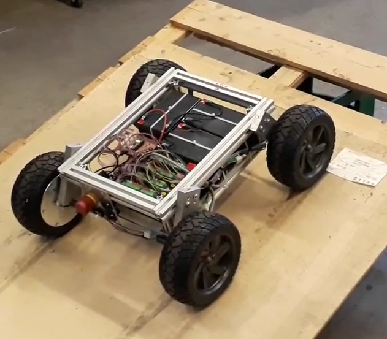
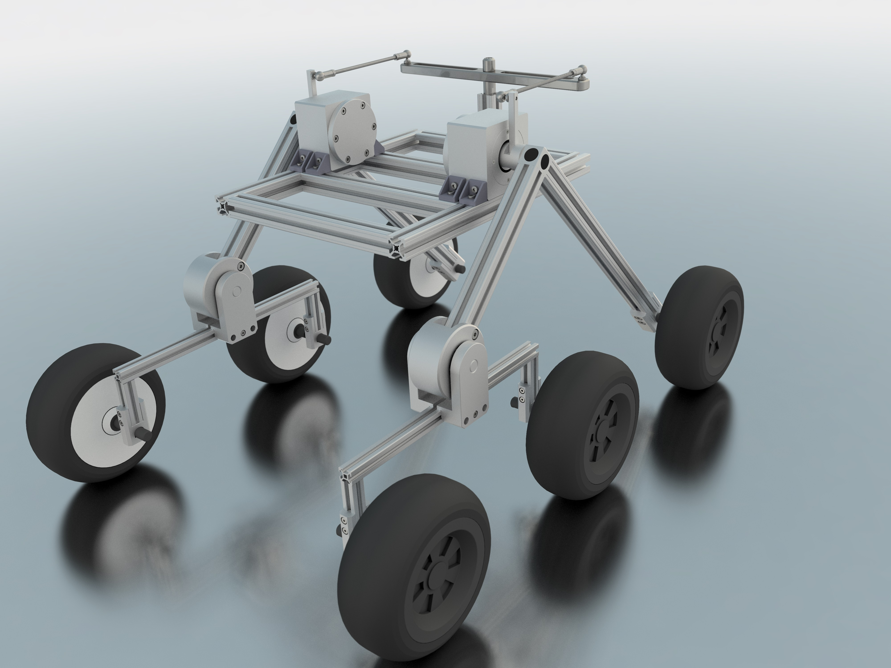

<h1>FRANCOR - Frankonian Open Robotics</h1>
<h2>CAD - Computer Aided Design Data of Robots</h2>

<h3>Overview</h3>
In this repository you can find the CAD data of all concepts and robots build
by the RoboCup Rescue Team FRANCOR.

<h3>Concepts</h3>

<h4>1. Concept: 8-Wheel Robot</h4>

The first meeting result in a concept of a 4 wheel drive robot based on the SummitXL Robot from Robotnik. The idea was to use 8 wheel hub drives to get enough power. This concept was quickly rejected, because it was to difficult to develop a cheap suspension. Furthermore the all-terrain mobility was not too good ( Problems with climbing stairs ).

<h4>2. Concept: 4-Wheel Robot</h4>

The second concept was a very simple platform with 4 wheels and no suspension. The idea was to first have a platform which can move ( even when the terrain mobility is very limited ) to set up the system and test software ( Sensors, PCs, ... ).

This kind of concept is the first which was build with simple aluminium profiles. But due to the fact, that the terrain mobility is very limited another concept was needed.

 2017-12-02: Morty's Mule Robot build with aluminium profiles

<h4>3. Concept: Rocker-Bogie Robot</h4>

The next concept is based on the rocker-bogie suspension used for many robots like the NASA Mars Rover Curiosity. The team decided to build a rescue robot based on this concept.
The benefits are a high terrain accesibility and a good compromise of simplicity and costs.

This concept is now under heavy development and can hopefully be built at end of the year 2017.

<h3>Current Progress</h3>

It was decided to move the suspension with angled profiles. This concept is now being worked out and the production of the components will start mid/end of December. The schedule provides for the mechanics to be assembled by the end of January.

Rocker-Bogie Robot 2017-12-16

Rocker-Bogie Robot 2017-12-18

Rocker-Bogie Robot 2017-12-19 with differential drive
