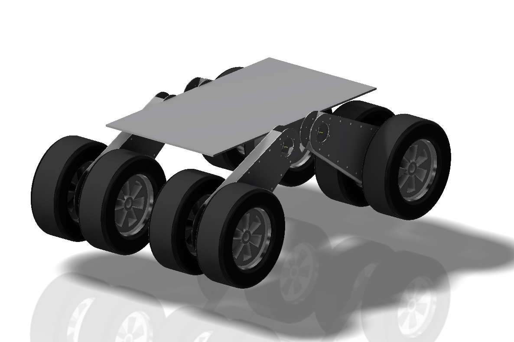
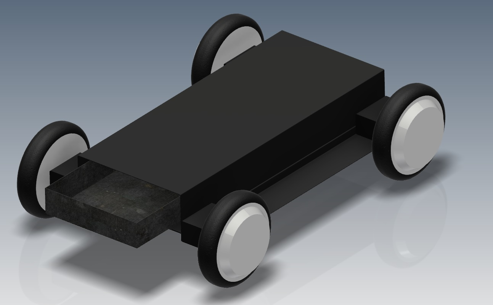
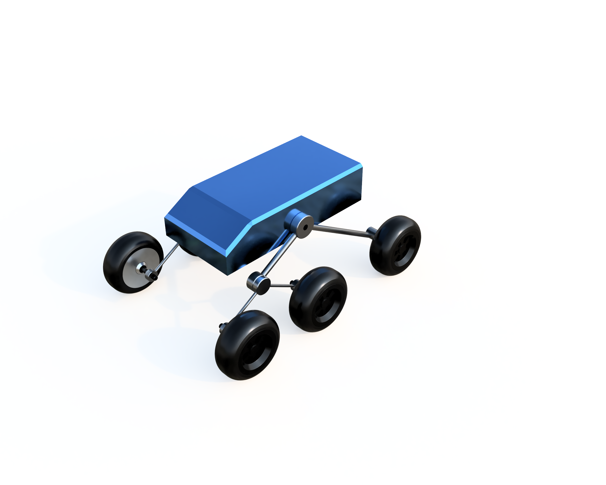
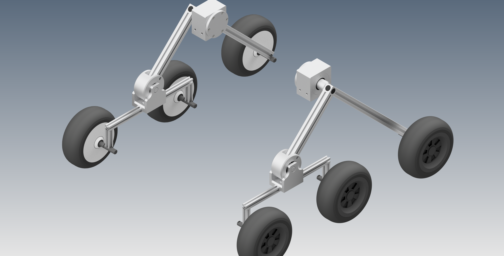
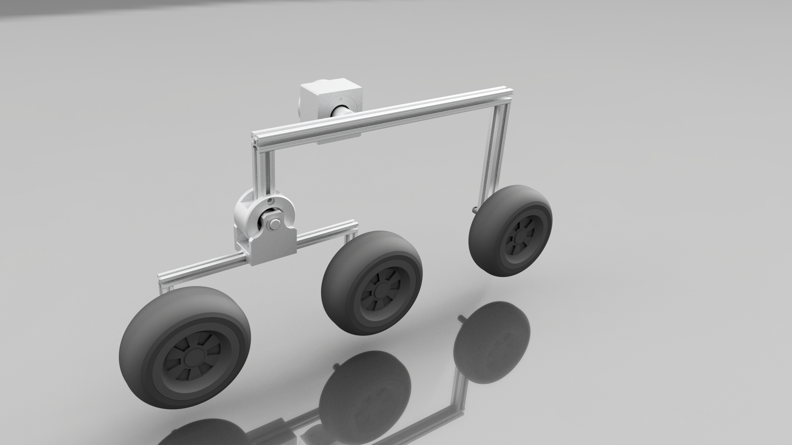

<h1>FRANCOR - Frankonian Open Robotics</h1>
<h2>CAD - Computer Aided Design Data of Robots</h2>

<h3>Overview</h3>
In this repository you can find the CAD data of all concepts and robots build
by the RoboCup Rescue Team FRANCOR.

<h3>Concepts</h3>

<h4>1. Concept: 8-Wheel Robot</h4>

The first meeting result in a concept of a 4 wheel drive robot based on the SummitXL Robot from Robotnik. The idea was to use 8 wheel hub drives to get enough power. This concept was quickly rejected, because it was to difficult to develop a cheap suspension. Furthermore the all-terrain mobility was not too good ( Problems with climbing stairs ).

<h4>2. Concept: 4-Wheel Robot</h4>

The second concept was a very simple platform with 4 wheels and no suspension. The idea was to first have a platform which can move ( even when the terrain mobility is very limited ) to set up the system and test software ( Sensors, PCs, ... ).

This kind of concept is the first which was build with simple aluminium profiles. But due to the fact, that the terrain mobility is very limited another concept was needed.

<h4>3. Concept: Rocker-Bogie Robot</h4>

The next concept is based on the rocker-bogie suspension used for many robots like the NASA Mars Rover Curiosity. The team decided to build a rescue robot based on this concept.
The benefits are a high terrain accesibility and a good compromise of simplicity and costs.

This concept is now under heavy development and can hopefully be built at end of the year 2017.

<h3>Current Progress</h3>

Two similar concepts are currently being developed. Both are based on aluminium profiles, which should allow an easy adjustment of the suspension lengths.

<h4>Concept Angle Connection</h4>

The first concept connects the bogie and the rear wheel via a 90 degree angle.

<h4>Straight Connection</h4>

The first concept connects the bogie and the rear wheel via only two profiles positioned at an angle of 90 degrees.
On the positive side, only two profiles are needed to connect the bogie and the rear wheel with the rocker bearing. However, it can happen faster that the middle wheel collides with the connection between rocker bearing and bogie or rocker bearing and rear wheel if the suspension is shortened.

